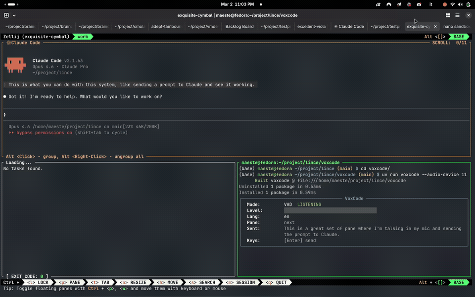

# LINCE

**Linux Intelligent Native Coding Environment** — [lince.sh](https://lince.sh)

A toolkit that turns your terminal into a multi-agent engineering workstation — spawn parallel AI coding agents, track their status in real time, relay voice commands, all from a single TUI dashboard running in Zellij.

## Demo



> The full workflow: voice command → Whisper transcription → Claude Code executes in sandbox → backlog updates — all from one terminal.

## The Dashboard

The primary way to use LINCE is the **TUI Dashboard** — a Zellij WASM plugin that acts as a command center for multiple AI coding agents.

New installations use a compact sidebar and a two-row attention bar. Choose a
statusline-only view or restore the full table with a preset; colors are independent.
See [Views and Themes](https://lince.sh/documentation/#/dashboard/views-and-themes).

What the dashboard gives you:

- **Multi-agent**: Spawn up to 8 AI coding agents in parallel (Claude Code, Codex, Bob, Gemini, OpenCode, Aider, and any custom agent), each in its own sandboxed pane
- **Real-time status**: See at a glance which agents are running, waiting for input, asking for permission, or stopped — five canonical states, color-coded
- **Pane control**: Show/hide agent panes with a keystroke (`f` to focus, `h` to hide)
- **Voice relay**: VoxCode transcriptions are piped directly to the focused agent
- **Session persistence**: Save/restore your agent constellation across sessions (`Q` to save & quit)
- **Swimlane grouping**: Agents auto-grouped by project directory when working across repos
- **Sandbox isolation**: Every agent runs inside [agent-sandbox](sandbox/) — full autonomy, zero host risk

## Quick Start

For a detailed step-by-step guide, troubleshooting, and quick reference, see [QUICKSTART.md](QUICKSTART.md).

### Prerequisites

- **Linux**: `curl`, `git`, and `bubblewrap` (tested on Fedora 43; Ubuntu/Debian/Arch are supported)
- **macOS** (experimental): `curl` and `git`; the built-in Seatbelt backend (`sandbox-exec`) is used, so Homebrew is not required
- At least one supported coding agent, installed separately

Zellij and a compatible Python are handled by the installer. If Zellij 0.45.1+
is missing, LINCE installs a static binary in `~/.local/bin`. If the system has
no Python 3.11+ with pip, LINCE installs a pinned standalone Python under
`~/.local/share/lince/python`.

### Install

Interactive installer:

```bash
curl -sSL https://lince.sh/install | bash
```

Non-interactive install with sane defaults:

```bash
curl -sSL https://lince.sh/install | bash -s -- --defaults
```

The installer downloads the released dashboard plugin, verifies its checksum,
and configures the sandbox, dashboard, updater, and shell command. Open a new
terminal (or source the profile for your current shell), then launch:

```bash
lince
```

Press `n` to spawn an agent (quick), or `N` for the full wizard. See the
[installation guide](docs/documentation/install.md) for manual and offline
installation, updates, provisioned tools, platform status, and checksum details.
The [Quickstart guide](QUICKSTART.md) covers the interactive scenarios.

## Build from source

The normal install uses the prebuilt, checksum-verified dashboard plugin and
does not need a compiler. Contributors who want to compile the plugin locally
need `rustup`, a C compiler/linker, and the `wasm32-wasip1` target:

```bash
rustup target add wasm32-wasip1
curl -sSL https://lince.sh/install | bash -s -- --build-from-source
```

### The Workflow in Practice

```
You (speaking):  "Pick up the next task from the backlog and start working on it"
                        │
                        ▼
VoxCode:         Whisper transcribes locally → pipes text to dashboard
                        │
                        ▼
Dashboard:       Routes text to focused/selected agent
                        │
                        ▼
Claude Code:     Reads the backlog via MCP → picks a task →
                 marks it in-progress → writes code → runs tests
                        │
                        ▼
Dashboard:       Status updates in real-time (Running → INPUT → Stopped)
                 Five canonical states: - / Running / INPUT / PERMISSION / Stopped
```

## Modules

### [lince-dashboard/](lince-dashboard/)

The multi-agent TUI dashboard — a Zellij WASM plugin (Rust, ~900 KB) that manages multiple AI coding agents (Claude Code, Codex, Bob, Gemini, OpenCode, and any custom agent). Spawn agents, monitor status, show/hide panes, relay voice input, persist sessions. Agent types are fully config-driven — add new agents via TOML or use the `/lince-add-supported-agent` skill. See [lince-dashboard/README.md](lince-dashboard/README.md).

Documentation: [Usage Guide](https://lince.sh/documentation/#/dashboard/usage-guide) | [Configuration](https://lince.sh/documentation/#/dashboard/config-reference) | [Agent Examples](https://lince.sh/documentation/#/dashboard/agent-examples)

### [lince-messages/](lince-messages/)

Optional skill-based conversations for Claude, Codex, Bob, Pi and OpenCode in their original
terminal panes. Agents use `lince-msg peers` and `lince-msg send` for questions
and replies, with a conversation reference and a lightweight delivery log in
Alt+d. No groups or task lifecycle. Enable the skill separately for each agent;
see the [operator guide](docs/agent-messaging.md) and
[validation limits](docs/agent-messaging-validation.md).

### [lince-config/](lince-config/)

Structured CLI for reading and editing LINCE configuration files (`~/.agent-sandbox/config.toml` and `~/.config/lince-dashboard/config.toml`). Preserves comments and formatting via `tomlkit`. Installed to `~/.local/bin/lince-config`.

Also powers the **`/lince-configure` skill** — a natural-language interface that lets any AI coding agent read and modify its own configuration interactively (conversational or guided-menu mode). Installed automatically by `quickstart.sh` or `lince-dashboard/install.sh`.

**Config v2**: configuration is converging on a single versioned policy file (`~/.config/lince/lince.toml`) + a shipped agent registry. Get started with `lince-config discover` / `lince-config apply <agent>+<level>+<provider>`; existing installs keep working unchanged — see the [user migration guide](docs/migration-v2-users.md) and the [developer migration guide](docs/migration-v2-developers.md).

### [sandbox/](sandbox/)

Bubblewrap-based sandbox for running AI coding agents safely. Restricts filesystem access, blocks git push, isolates environment variables, and hides host processes — with near-zero overhead. Supports any agent via `--agent` flag (`agent-sandbox run -a codex`, `-a gemini`, etc.). Used by the dashboard to spawn every agent.

Documentation: [CLI Reference](https://lince.sh/documentation/#/sandbox/cli-reference) | [Configuration](https://lince.sh/documentation/#/sandbox/config-reference) | [Security Model](https://lince.sh/documentation/#/sandbox/security-model)

### `/lince-add-supported-agent` skill (bundled with lince-dashboard)

An [agentskills.io](https://agentskills.io)-compliant skill that lets any AI coding agent register itself with the lince ecosystem. Generates correct TOML configuration for both agent-sandbox and lince-dashboard. Installed automatically by `lince-dashboard/install.sh`.

### `/lince-configure` skill (bundled with lince-dashboard)

An [agentskills.io](https://agentskills.io)-compliant skill for natural-language configuration of LINCE. Ask any AI agent to configure providers, change sandbox levels, set API keys, adjust dashboard settings, or diagnose issues — it drives `lince-config` under the hood. Supports conversational and guided-menu interaction. Installed automatically by `lince-dashboard/install.sh` (requires the `lince-config` CLI).

## Related Projects

| Project | Description |
|---------|-------------|
| [VoxCode](https://github.com/RisorseArtificiali/voxcode) | Voice input for AI agents — local Whisper transcription, integrates with the dashboard via Zellij pipes |
| [VoxTTS](https://github.com/RisorseArtificiali/voxtts) | Text-to-Speech with local GPU/CPU engines (Kokoro, Piper) |
| [Agent Ready Skill](https://github.com/RisorseArtificiali/agent-ready-skill) | Assess any project's readiness for agentic coding (agentskills.io) |

## License

MIT

### Dashboard presentation

New installs use a minimal dashboard: compact sidebar, no frames, and a
two-row status bar. `lince-dashboard-launch --preset classic` restores the full
presentation; `--preset statusline` uses an on-demand menu with no sidebar.
`--frames` restores pane frames. `Alt+d` opens the expanded list, `Alt+i` information, `Alt+h` help, and `Alt+n`
the wizard. `Alt+s` toggles the 15% sidebar and `Alt+b` cycles the status bar: hidden → left summary → full → agents only in either managed preset. `Alt+q` saves
agents, sidebar visibility and the status bar mode for the next launch, then quits; `Alt+d`, then `q`, quits without saving.
See the [presentation settings](docs/documentation/dashboard/config-reference.md)
and [epic #312 smoke tests](docs/design/dashboard-312-smoke-tests.md).
