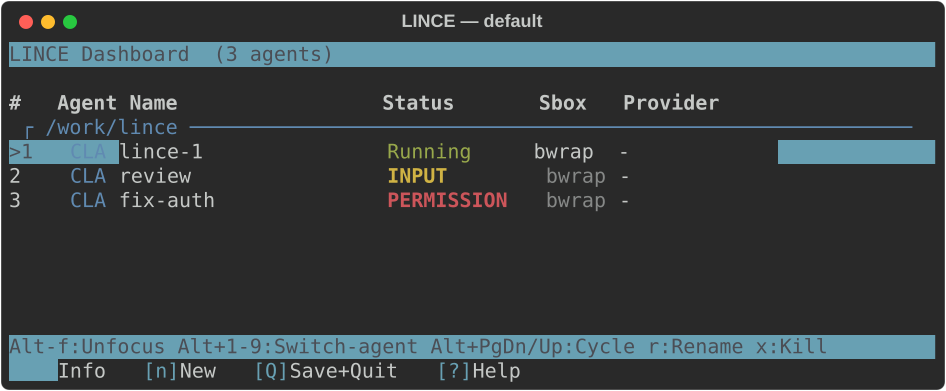
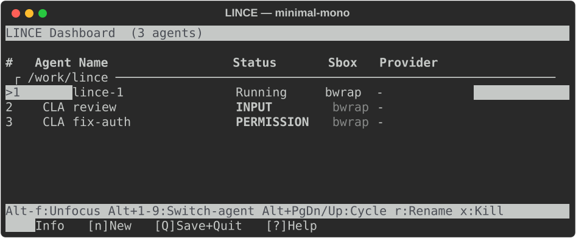
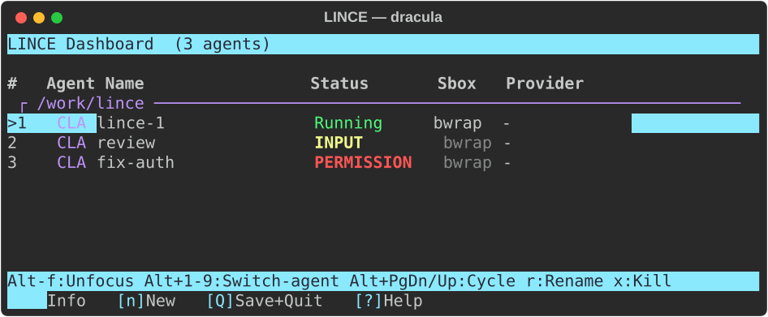
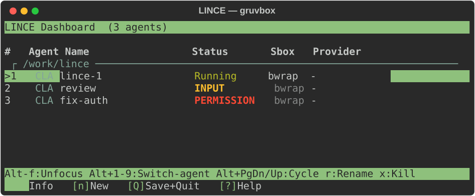

# Views and themes

Choose how much space LINCE uses without changing your agents or their saved state.
A **preset** selects the layout and default density; a **theme** selects UI colors independently.

## Choose a view

Start a new session with the installed launcher:

```bash
lince-dashboard-launch --preset minimal
lince-dashboard-launch --preset statusline
lince-dashboard-launch --preset classic
```

| Preset | Presentation | Default sidebar width | Frames |
|--------|--------------|-----------------------|--------|
| `minimal` | Compact sidebar and a two-row attention bar; no standard Zellij bars | 15% | Off |
| `statusline` | Same managed view, with the sidebar hidden initially | 15% when shown | Off |
| `classic` | Full agent table and standard Zellij tab/keybinding bars | 40% | On |

Fresh installations use `minimal`. Updating an existing configuration without a
preset preserves `classic`. Minimal and statusline differ only in initial sidebar
visibility; `Alt+s` toggles it at runtime, restoring the same column arrangement
on every second press. With the sidebar hidden, agent panes fill the window
above the status line. An open agent stays visible and keeps focus when the
sidebar reappears, resizing to the narrower viewport. This also applies to the
first toggle after switching agents with `Alt+1/2/3`; other agents stay hidden. The sidebar is always compact and popup
lists are always expanded. `compact` applies only to the classic inline view.
Explicit `sidebar_width` and `pane_frames` settings override preset defaults; selecting `classic` does not reset those settings.
The `lince` alias uses the configured preset. Preset and geometry changes apply to
new sessions, not when attaching to an existing session.

Persist your choices in `~/.config/lince-dashboard/config.toml`:

```toml
[dashboard]
preset = "minimal"
sidebar_width = 25
pane_frames = false
theme = "dracula"
```

`sidebar_width` accepts integer percentages from 10 to 60. Command-line overrides
are available for a single launch:

```bash
lince-dashboard-launch --preset minimal --sidebar-width 25 --frames
lince-dashboard-launch --preset classic --no-frames
lince-dashboard-launch --preset minimal --layout dashboard
lince-dashboard-launch --preset minimal --layout dashboard-tiled-vox
```

The last command requires VoxCode. `dashboard` selects floating agent windows;
`dashboard-tiled` (the default) fits the focused agent to the right-hand viewport.
Use the launcher to apply these settings: launching a KDL file directly bypasses
preset generation and the session configuration.

## Compact sidebar and details

Press `Alt+d` from any pane to open the expanded agent list in a bordered popup.
The bare `d` density toggle has been removed. `Alt+s` shows or hides the sidebar
and its shell/voice pane, preserving agents and restoring the configured column layout.
The compact list shows the global agent number on the left, the configured
three-cell type label (`CLA`, `CDX`, etc.) and a one-letter status. Agent names
remain available in `i` details and in the attention row, keeping the sidebar narrow.
Bold project headings use distinct palette colors and a horizontal rule to separate
swimlanes; `i` reveals the full name and path.

`>` marks selection, `*` marks the focused agent, and `!` flags a sandbox level
other than `normal`, including unknown or unsandboxed runs. Details and the active
entry in the attention bar convey the sandbox level through color; details show
the explicit identity (`NOSB` means unsandboxed).

Use `j`/`k` to select, `Enter` or `f` to focus, and `i` for details.
`PageUp`/`PageDown` scroll long details. In the minimal view, details, help and
creation dialogs open in a larger bordered popup without resizing the sidebar or viewport.
`Alt+i` opens the focused agent’s information directly; `Alt+h` opens help.
`Esc` dismisses a dialog; local `i` and `?` remain available in the list.

## Attention and navigation

Minimal and statusline views reserve two LINCE rows at the bottom. Its leading `!N`
counts only agents waiting for input or permission. The compact overview that follows
shows **all** agent slots in navigation order: `!2 1R2I3P4S5-`, for example.
The left-hand numbers and letters use state colors: green for running, yellow for
input, red for permission and muted for unknown/stopped. The count uses a distinct
accent (cyan by default), including in the monochrome palette.

On the right, each entry is `NUMBER AGENTTYPE-NAME STATUS`, for example `2 CDX-pippo I`.
The type is the same configured label as the full list (`CLA`, `CDX`, etc.).
The name is the first five characters of the actual name, with no `P-N` abbreviation.
`AGENTTYPE-NAME` uses the sandbox-level color: red for unsandboxed, green for
normal/default, yellow for permissive, white for paranoid or custom/unknown levels.
The status letter has its own state color, independently of the name. These
semantic colors follow the selected palette.
The selected `*number` is white; other numbers share the name color. Entries stay
in slot order and do not show a textual sandbox level. The count and compact slot overview take priority over
ordinary names when the terminal is narrow; the overview is clipped if it cannot fit.

| Letter | State | Counted as waiting |
|--------|-------|--------------------|
| `R` | Running | No |
| `I` | Waiting for input | Yes |
| `P` | Permission required | Yes |
| `S` | Stopped | No |
| `-` | Unknown or no native status hooks | No |

While typing in an agent, `Alt+d` opens the controller, `Alt+1`–`Alt+9` selects
an agent, and `Alt+PageUp`/`Alt+PageDown` cycles agents. Bare letters are sent to
the agent. With the attention row focused, digits select agents, arrow keys cycle,
and Enter opens the controller.

These shortcuts work with either preset, including while the sidebar is visible:

| Key | Action |
|-----|--------|
| `Alt+d` | Expanded agent list in a bordered popup |
| `Alt+i` | Focused agent information directly |
| `Alt+h` | Help directly |
| `Alt+s` | Hide/show the sidebar and its shell/voice pane |
| `Alt+b` | Cycle status bar: hidden → left summary → full |
| `Alt+n` | Agent creation wizard (replaces Zellij’s new-pane shortcut) |
| `Alt+q` | Save the session and quit from any pane |
| `q` in the `Alt+d` list | Quit without saving |

Immediately after opening the wizard, or in its selection/review steps, `n` skips to a name-only prompt
using the configured defaults. In name/path text fields, `n` remains ordinary text.
There is no separate `Alt+N` binding. The list’s local `n` (default creation), `N`
(wizard), `r` (rename), `i` (details), and `s`/`S` (relay) also remain available.
Selecting an agent returns to its terminal. `Esc` dismisses the current dialog,
then the underlying menu if one was open. Popup borders remain visible even with
`pane_frames = false`.

Additional Zellij tabs retain the attention row and connect to the session's
controller. Native Zellij fullscreen or manually hiding the row can suppress it;
leave fullscreen to return to the managed view.

## Save and quit

`Alt+q` saves the current agent configuration to `.lince-dashboard` in the launch
directory, then quits only after the write succeeds. It also works in locked mode.
To leave without saving, open the list with `Alt+d` and press lowercase `q`.
Any previously saved state remains intact. Uppercase `Q` in the list remains a
save-and-quit alias.

## Color palettes

Set `dashboard.theme` in the dashboard config, or use:

```bash
lince-config set dashboard.theme dracula --target dashboard
```

Theme changes reload in about five seconds. They affect LINCE's list, details,
wizard and attention row; agent applications retain their own colors.

| Theme | Palette |
|-------|---------|
| `default` | Inherits the active Zellij style; also used when the key is omitted |
| `minimal-mono` | Restrained monochrome colors with selection and status markers |
| `dracula` | Dark purple palette |
| `gruvbox` | Warm, muted palette |

Unknown names display a warning in the controller and fall back to `default`.
Status letters and markers remain available without relying on color.

These previews are generated from the dashboard renderer with sample agents;
they illustrate the palettes in the full table, not the geometry of each preset.






## Zellij configuration and updates

The launcher uses `~/.config/lince-dashboard/zellij.kdl`. Installation and updates
preserve custom settings and refresh `zellij.kdl.dist` with shipped defaults.
Updates migrate only the previously shipped Alt+h/i/l/n bindings and add Alt+q alongside LINCE’s wizard bindings, saving the old
file as `zellij.kdl.bak-shortcuts`. Custom bindings remain yours; compare with
`.dist` if they conflict with LINCE shortcuts.
Your global `~/.config/zellij/config.kdl` is separate. To use another session config:

```bash
lince-dashboard-launch --config /path/to/zellij.kdl --preset minimal
```

Keep LINCE's `lince-ui-open`, `lince-sidebar-toggle`, `lince-save-quit`, `focus-agent` and `cycle-agent` bindings when copying
or customizing the session configuration. See the [configuration reference](dashboard/config-reference.md)
for all keys and the [usage guide](dashboard/usage-guide.md) for agent workflows.

The attention bar reserves two rows and wraps between complete agent entries.
Nine agents with five-character ASCII names fit at 100 columns. Agent entries
stay in slot order even when selected. Each reserves a marker position: the
selected `*number` is white; other numbers share the sandbox color of their
names. The sandbox level is conveyed by color, without a bracketed label.
The left-hand count and agent numbers sit on the second row. Only `R` bounces
vertically between the two rows. `I` and `P` stay on the second row in their status colors, with a `v`
directly above on the first row. Only the `v` alternates yellow/red; the letters
and numbers keep their status colors. Stopped/unknown states stay on the second row. The reserved left column
keeps names and wrapping stationary, even with nine agents. A legacy single-row
pane keeps the full numbered status overview static.

`Alt+b` cycles the status bar through hidden, left summary only, and full in minimal/statusline, including locked mode. The two visible modes use two rows. Agent panes reclaim its rows when hidden. `Alt+s` and `Alt+b` can hide both surfaces; agent navigation and the global dialogs remain available. Explicit sidebar widths remain configurable. `Alt+q` saves sidebar visibility and the status bar mode in the project’s `.lince-dashboard`; the next launch restores them over the initial minimal/statusline preset. Older saved sessions keep the preset defaults. `Alt+d`, then `q`, leaves the previous saved view unchanged.
